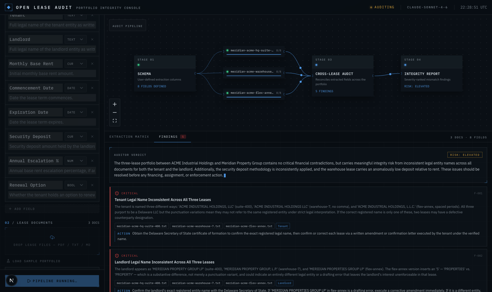

# Open Lease Audit

[](LICENSE)
[](https://nextjs.org)
[](https://www.typescriptlang.org)
[](https://code.claude.com/docs/en/agent-sdk)
[](https://vercel.com/new)

Upload a portfolio of commercial leases and a team of Claude agents audits it.
Specialist detectors sweep for defects, an adversarial materiality gate throws
out everything that would not cost you money or land you in court, and only
what survives reaches the screen.

**The product is the filter.** A lease review that returns forty observations is
worthless — nobody reads it, and nothing gets acted on. This one is built to
return three findings you can put in front of a lawyer.



## What counts as a finding

A defect is surfaced only if it clears both tests:

1. **Consequence** — it plausibly causes a quantifiable monetary loss, or a
   dispute a counterparty could credibly bring or win.
2. **Substantiation** — it rests on text quoted verbatim from a named lease, or
   on the demonstrable absence of a term the rest of the document depends on.

Every agent must be able to state the loss mechanism in one sentence: what
happens, to whom, and how it costs them. Drafting style, formatting, missing
nice-to-haves, and "consider reviewing" observations are dismissed by design,
and the console tells you how many were withheld.

## How it works

Built on the [Claude Agent SDK](https://code.claude.com/docs/en/agent-sdk). One
`query()` drives a lead auditor that dispatches subagents through four stages:

```
                     ┌── lease-abstractor ──┐
  SCHEMA.md ─────────┼── lease-abstractor ──┼── abstracts/*.json
  (your columns)     └── lease-abstractor ──┘        │
                                                     ▼
                     ┌── rent-and-charges-auditor ───┐
                     ├── liability-and-covenant-…  ──┼── candidates/*.json
                     ├── critical-date-auditor  ─────┤
                     └── portfolio-reconciler ───────┘
                                                     │
                                                     ▼
                                          materiality-gate
                                     (re-reads every quote, tries
                                      to refute, dedupes, ranks)
                                                     │
                                                     ▼
                                     published findings + verdict
```

1. **Abstract** — one agent per lease, in parallel. Reads the whole document and
   reports your schema fields, each with a verbatim supporting quote.
2. **Detect** — four specialists sweep the portfolio concurrently, each with its
   own beat and its own instructions on what its beat's expensive failures look
   like. They file *candidates*, which are never shown to you.
3. **Gate** — one adversarial reviewer. Its default answer is no. It opens each
   named lease, finds the quote, checks whether the loss actually follows,
   checks whether a later clause cures it, deduplicates across detectors, and
   publishes only survivors.
4. **Close** — the lead publishes the portfolio verdict.

### Design notes

- **The workspace is shared memory.** Uploaded leases are written to a temp
  directory the agents read with their own file tools. Each stage writes its
  output back (`abstracts/`, `candidates/`), so the next stage reads it off disk
  instead of through the orchestrator's context window. The orchestrator stays
  small no matter how large the portfolio is.
- **Structured output only.** Findings reach the UI exclusively through
  in-process MCP tools (`record_abstract`, `report_candidate`, `publish_finding`,
  `dismiss_candidate`, `publish_summary`). Prose an agent writes is never parsed,
  so a finding that was not published does not exist.
- **Read-only sandbox.** Agents get `Read`, `Grep`, `Glob`, the audit tools, and
  nothing else. `Bash`, `Write`, `Edit`, and network tools are removed, and a
  `canUseTool` callback denies anything not explicitly allowed — so instructions
  embedded in an uploaded lease cannot widen the sandbox.
- **Deterministic staging.** Background subagent dispatch is disabled, so each
  stage completes before the next begins and no tool call lands after the run.
- **Bounded spend.** Every run carries a hard `maxBudgetUsd` ceiling.

The console streams the run as NDJSON: agent starts and finishes, each tool call,
every abstracted cell, every candidate, and every gate ruling.

## Quick start

```bash
pnpm install
cp .env.example .env.local   # add your Anthropic API key
pnpm dev
```

Get a key at [console.anthropic.com](https://console.anthropic.com/settings/keys).
If you are already signed in with the Claude Code CLI on this machine, the SDK
picks up that login and no key is needed.

Use **Load sample portfolio** to try it instantly — three sample leases with
planted defects: entity-name drift across documents, a security deposit that
contradicts its own "one month's rent" clause, conflicting expiration dates, a
holdover premium that starts after the term ends, and divergent insurance and
notice terms.

## Systems of record (optional)

Attach a portfolio system and the detectors reconcile each lease against what
your system actually records — a term that disagrees with the rent roll is
usually where the recoverable money is.

| Connector | What it adds |
| --- | --- |
| [Yardi Virtuoso](https://claude.com/connectors/yardi-virtuoso) | Rent roll, charge schedules, work orders, financials |
| [Yardi Matrix](https://claude.com/connectors/yardi-matrix) | Comparable rents, submarket performance, ownership |

Paste the MCP endpoint (and a bearer token, if the endpoint is not already
OAuth-authorized for your account) in the console's **Systems of record** panel.
Credentials stay in the browser tab, are sent only with the audit request, and
are never persisted. The agents get read access only — nothing is written back.

## Configuration

| Variable | Purpose |
| --- | --- |
| `ANTHROPIC_API_KEY` | API key for the Agent SDK. Not needed if the host has a Claude Code login. |
| `OPEN_LEASE_AUDIT_MODEL` | Model for the lead, detectors, and gate (default `claude-opus-5`) |
| `OPEN_LEASE_AUDIT_ABSTRACTOR_MODEL` | Model for the per-lease abstractors (default: inherit) |
| `OPEN_LEASE_AUDIT_MAX_BUDGET_USD` | Hard spend ceiling per run (default `8`) |

## Architecture

| Path | Role |
| --- | --- |
| `lib/agent/run.ts` | Drives `query()`, maps SDK messages to console events |
| `lib/agent/subagents.ts` | Agent roster: abstractor, four detectors, materiality gate |
| `lib/agent/doctrine.ts` | The materiality bar, injected into every detector and the gate |
| `lib/agent/tools.ts` | In-process MCP server — the only channel to the UI |
| `lib/agent/workspace.ts` | Temp workspace + `SCHEMA.md`, shared memory between stages |
| `lib/agent/bus.ts` | Async queue merging SDK messages with tool output |
| `app/api/audit/route.ts` | Streams the run as NDJSON |
| `hooks/use-audit-engine.ts` | Client run state machine |
| `components/app/` | Console: schema builder, intake, connectors, canvas, matrix, findings |
| `public/samples/` | Sample lease portfolio with planted defects |

## Deploy

```bash
vercel
```

The Agent SDK spawns a Claude Code subprocess and ships native binaries, so the
audit route runs on the Node.js runtime with `serverExternalPackages` set.
Add `ANTHROPIC_API_KEY` to the project environment, and give the function a
timeout that fits a real portfolio audit — runs take minutes, not seconds.

## License

[MIT](LICENSE)
